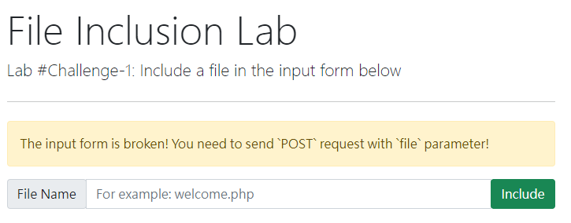
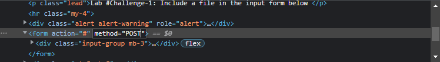
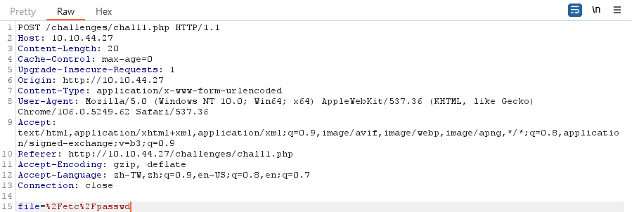

<!--more-->

### 前言

---

### 什麼是 Local File Inclusion？

- php 中，如果需要使用到另外一個 php 檔案並加入到現有的頁面中，通常會使用 [include()](https://www.php.net/manual/en/function.include.php) 這個函數，用來實現單個頁面顯示多種網頁的效果
- 通常這個 include 內的參數，會根據網頁設計者預先定義好的行為套入不同的參數
  - GET: 直接將 url 的 query 作為參數使用
  - POST: 將 content 內的資訊作為參數使用
- 然而對於使用者而言，GET 與 POST 的參數是**可以被使用者修改**的
- 因此如果在沒有妥善過濾的情況下，有可能會被讀取到**預期外的檔案**
  - 透過暴力嘗試，可以被讀取到一些**預設路徑**的檔案，造成敏感資訊洩漏
  - ex. /etc/passwd
- 甚至在權限允許的狀況下，可以讀取並執行遠端的檔案，造成 **RFI (Remote File Inclusion)**

---

### 常見的 LFI 姿勢

- 直接進行 LFI
  - 由於 include() 可以接受**絕對路徑**作為參數，因此可以直接將已知的檔案絕對路徑輸入
- dot dot slash(../)
  - 由於 include() 也可以接受**相對路徑**作為參數，因此透過 linux 本身父目錄的連結 **..**，前進到 web server 資料夾以外的資料夾
  - 透過多次進行 **../**，可以一路前進到根目錄 **/**，並且根目錄的 **../** 亦會在根目錄中
  - 前進到根目錄後，可以根據一些預設的路徑/檔案 **(/etc/passwd、/var/log)** 等進行查詢
    - windows 系統則是會進入到磁區的根目錄 **(ex.C:/、D:/)**
- 可能洩漏的敏感資訊
  - /etc/issue
  - **/etc/profile:環境變數**
  - /proc/version
  - **/etc/passwd:可能存在的 users**
  - **/etc/shadow:user 密碼的 hash 值**
  - **/root/.bash_history:root 的 bash 輸入紀錄**
  - /var/log/dmessage
  - **/var/mail/root:root 的 email 資訊**
  - **/root/.ssh/id_rsa:root 的 rsa 私鑰資訊**
  - **/var/log/apache2/access.log:apache log 檔**
  - C:\boot.ini
- RFI(Remote File Inclusion)
  - 當 allow_url_fopen 與 allow_url_include 選項開啟時，攻擊者可以透過自己伺服器存在的惡意 php 檔，來進行遠端程式碼執行
    - 可以在自己的伺服器上開個簡單伺服器來達到這個效果
      - **python3 -m http.server 8000**
    - php 檔案可能可以執行的內容
      - **echo + shell_exec()**: 執行 shell script 並將結果 echo 到目前的 php 檔案上

---

### 常見的過濾方式與再次繞過

- include() 中加入預設路徑
  - ex. include("languages/". $_GET['lang']);
  - 上面的路徑會讓所有傳入的路徑前加上 languages/，導致無法利用絕對路徑進行 LFI
  - solution: 使用**相對路徑(../)**來跳出預設的路徑
- include() 中加入預設副檔名
  - ex. include($_GET['lang'] . ".php")
  - 上面的路徑會讓所有要被讀取的檔案名稱尾端加入 .php，導致非 php 檔案讀取失敗
  - solution: **空字串(%00 / 0x00)**
    - 透過輸入空字元，讓 include 函數忽略 **%00** 之後的所有資訊，包含 **.php**
    - 需要透過 burp 等工具對封包進行修改，無法直接在 url 或表單輸入 %00 / 0x00
    - 已在 **php 5.3.4** 修復
- 對目標檔案直接進行過濾
  - 將 /etc/passwd 進行比對來過濾成空字串
  - solution
    - 透過 **空字串** 來增加額外的資訊，嘗試繞過，ex. /etc/passwd%00123456
    - 透過 **當前目錄** 的連結 (/.) 來增加額外的資訊，嘗試繞過，**ex. /etc/passwd/.**
- 對 ../ 進行過濾
  - 將 ../ 過濾成空字串
  - solution:重複**兩次 ../ 的過程**，讓過濾掉的結果仍然有 ../，**ex. ....//....//....//etc/passwd**
- 將 allow_url_fopen 與 allow_url_include 設定為 false
---
### 實際演練

- TryHackMe File Inclusion Challenge 1

- 說明提到 form 壞掉了，需要使用 POST 以及用 File 做為參數
  
  - 有兩種方法可以修好這個 request
    - 用開發人員工具去將 form 本身的 method 從 GET 改成 POST 
    
    - 將最後要發出去的 GET 封包改成 POST，並添加上特定標頭
    
- 修改完之後，由於這題沒有做任何的過濾，可以直接去讀取到 flag 檔案

- TryHackMe File Inclusion Challenge 2
- TryHackMe File Inclusion Challenge 3
- TryHackMe File Inclusion Challenge RFI